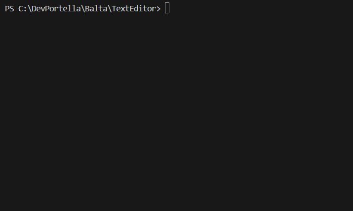

# 📝 Text Editor

A simple console text editor built in C# / .NET 8.

<p align="left">
  
</p>

## Features

- Create and edit text directly in the console.
- Press ESC to instantly save and return to the main menu.
- Simple file navigation: open, edit, and save existing text files.
- Input validation prevents crashes on empty or invalid paths.
- Clean and minimal interface for a smoother user experience.

## What I learned

- Handling character-by-character input with Console.ReadKey.
- Using StringBuilder to efficiently store user-typed content.
- Implementing file I/O operations with StreamReader and StreamWriter.
- Structuring logic into clear, reusable methods (Menu, Open, Edit, Save).
- Enhancing UX through small but meaningful interactions (like ESC-to-save).

## How to run

Clone this repository and run the project with .NET:

```bash
git clone https://github.com/devportella/texteditor.git
cd texteditor
dotnet run
```